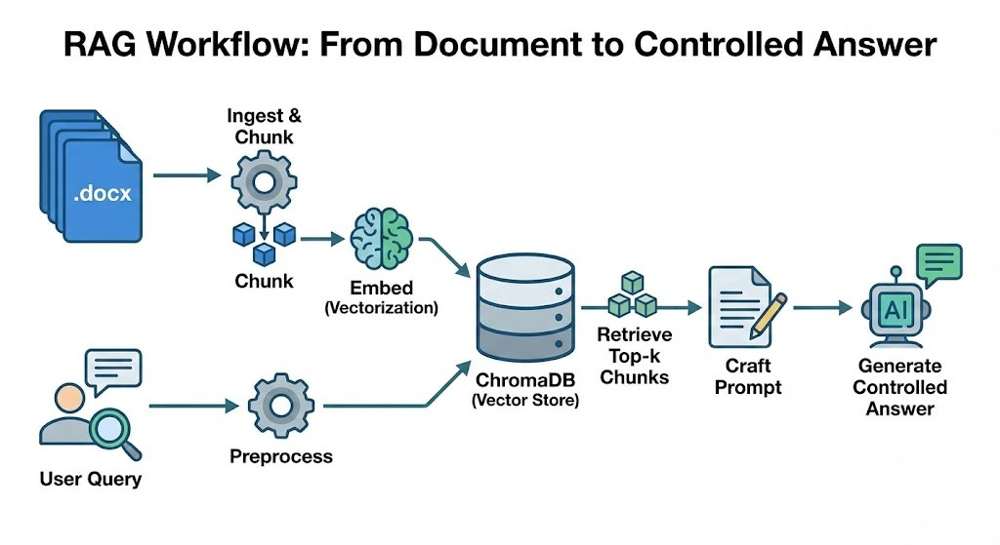
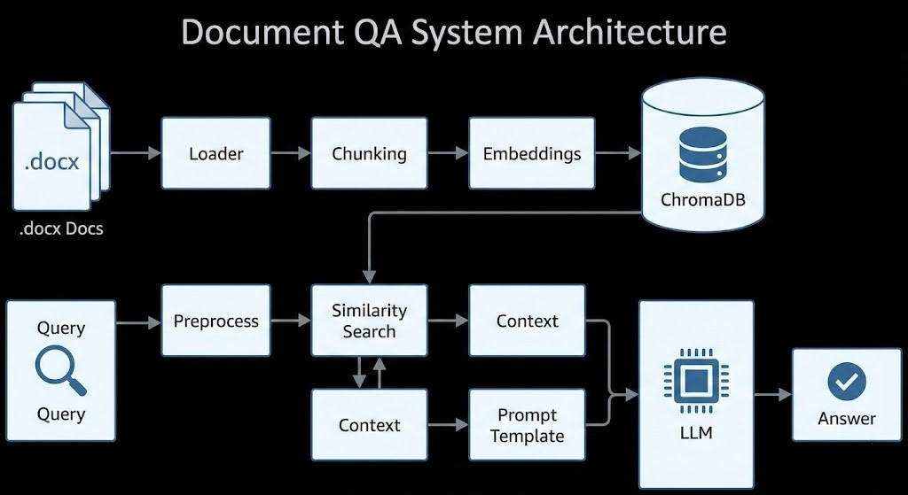
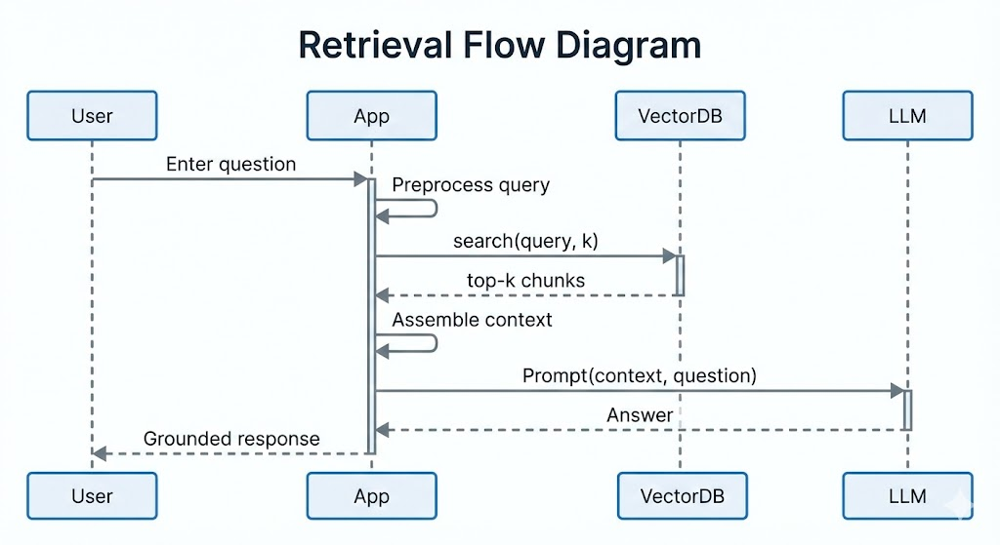

# Technical Documentation Retrieval-Augmented AI Assistant

This repository hosts a Retrieval-Augmented Generation (RAG) assistant for answering questions over technical & project documentation. It retrieves relevant text chunks and generates grounded responses using multiple LLM providers.


## Overview
The workflow: ingest `.docx` files → chunk → embed → store in ChromaDB → preprocess queries → retrieve top-k chunks → craft prompt → generate controlled answer. 


## Architecture Diagram


## Retrieval Flow Diagram


## Project Structure
```
rag_based_ai_assistant/
├── src/
│   ├── app.py            # Main application
│   ├── vectordb.py       # Vector store wrapper
│   ├── preprocess.py     # Query preprocessing utilities
│   └── evaluation.py     # Retrieval metrics evaluation
├── data/                 # Documentation source files (.docx)
│   └── eval/             # Evaluation queries & labels
├── chroma_db/            # Persistent ChromaDB storage
├── requirements.txt      # Dependencies
├── Publication .md       # Expanded publication
└── README.md             # This file
```

## Prompt Template (Excerpt)
Answers must rely ONLY on retrieved context. If insufficient, respond: `I don't have enough information to answer this question.`

## Query Preprocessing (`src/preprocess.py`)
Steps applied (configurable): lowercasing, whitespace normalization, punctuation removal, stopword filtering, synonym expansion. Improves recall and reduces noise.

## Retrieval Metrics
| Metric | Purpose | Interpretation |
|--------|---------|---------------|
| Recall@K | Coverage | High = fewer missed relevant chunks |
| Precision@K | Quality | High = fewer irrelevant chunks returned |
| MRR | Ranking | Early appearance of first relevant chunk |
| nDCG (optional) | Ranking + graded relevance | Considers ordering and relevance weights |

Run evaluation after labeling queries: see Evaluation section.

## Evaluation Usage
1. Create `data/eval/queries.json` entries like:
```json
[
  {"query": "What embedding model is used?", "relevant_ids": ["doc_0_chunk_0"]}
]
```
2. Index documents (first run of `app.py`).
3. Run:
```bash
python src/evaluation.py --queries data/eval/queries.json --k 5
```
4. View printed metrics summary.

## Safety & Prompt Injection Mitigation
- Template enforces context-only answers.
- Explicit refusal phrase for missing context.
- Preprocessing can strip suspicious control phrases (future extension).
- No execution of instructions found in documents.

## Installation
```bash
git clone https://github.com/ashrafyahya/rag_based_ai_assistant
cd rag_based_ai_assistant
python -m venv myVenv
myVenv\Scripts\activate  # Windows
pip install -r requirements.txt
```

Create `.env`:
```
OPENAI_API_KEY=your_openai_key_here
GROQ_API_KEY=your_groq_key_here
GOOGLE_API_KEY=your_google_key_here
```

Add `.docx` files to `data/`.

## Running
```bash
python src/app.py
```
Enter questions; type `quit` to exit.

## Evaluation
```bash
python src/evaluation.py --queries data/eval/queries.json --k 5
```

## Extending
- Swap embedding model via `EMBEDDING_MODEL` env var.
- Add re-ranking (cross-encoder) for better ordering.
- Add citations by appending chunk IDs to answers.

## Resources
- LangChain Docs
- ChromaDB Docs
- Sentence Transformers
- OpenAI / Groq / Google Gemini APIs

## Change Log (Enhancements)
- Added architecture & flow diagrams
- Added evaluation & preprocessing modules
- Added metrics & safety sections
- Clarified domain scope
